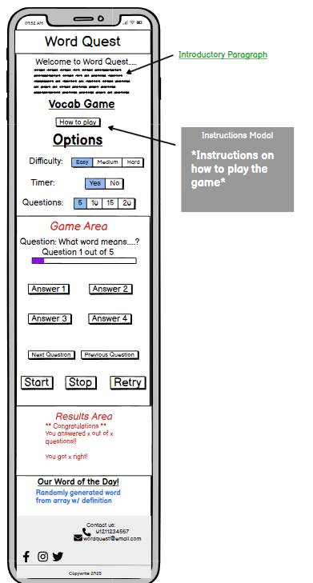
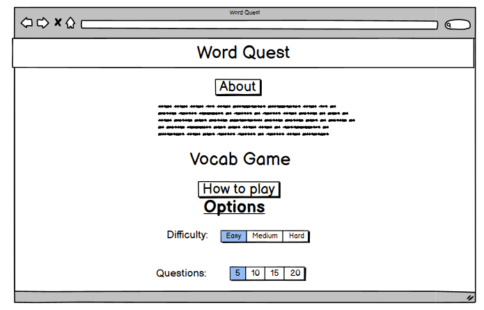
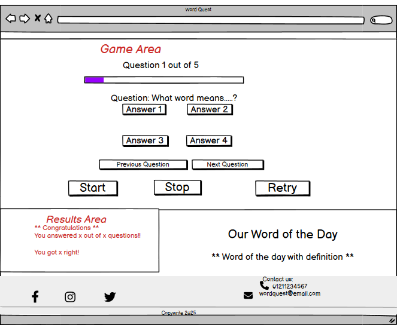

# WordQuest – Vocabulary Quiz Game

WordQuest is a simple, single-page vocabulary quiz built with HTML, CSS, Bootstrap, and JavaScript. Players answer five multiple-choice questions, each showing a word and four possible definitions. The game emphasizes accessibility, clarity, and confidence-building for young or beginner-level English learners.

**Live Demo:** _To be added after GitHub Pages deployment_  
**Repository:** https://github.com/darakhshanda/Hackathon1  

---

## Table of Contents
- [Overview](#overview)  
- [Site Goals](#site-goals)  
- [User Stories](#user-stories)  
- [Backlog](#backlog)  
- [Design](#design)  
- [Wireframes](#wireframes)  
- [Features](#features)  
- [Accessibility](#accessibility)  
- [Getting Started (Local Dev)](#getting-started-local-dev)  
- [File Structure](#file-structure)  
- [Testing](#testing)  
- [Bugs & Issues](#bugs--issues)  
- [Deployment](#deployment)  
- [Technologies Used](#technologies-used)  
- [Team & Roles](#team--roles)  
- [Development Workflow](#development-workflow)  
- [Roadmap](#roadmap)  
- [Schedule](#schedule)  
- [License](#license)

---

## Overview

WordQuest delivers a clean MVP experience:

- Intro + instructions  
- A 5-question quiz (each with 4 answer options)  
- Large, colorful buttons for accessibility  
- Results page with score  
- Game controls: start, next/back (optional), submit, restart  

This project is collaboratively built by a small team with clear roles and a shared GitHub workflow.

---

## Site Goals

### Core Functionality
- Provide an online quiz of at least 5 words with 4 possible answers each  
- Collect user answers and show final results  
- Provide large, bold, high-contrast UI elements for accessibility  
- Keep things simple as a single-page app (`index.html`) with linked CSS/JS in head for easy initial collaboration / no context switching. Until final.

### User Experience
- Simple instructions and readable UI  
- Child-friendly design using colorful Bootstrap components  
- Clear quiz progression and final score feedback  

### Scalability
- Add difficulty levels using arrays. E.g
		  "text: "What does Cold mean",
  options: ["Not warm; chilly", "Soft and furry", "Full of sunshine and heat", "Very loud and noisy"],
},"
- Add custom question sets  
- Optional grading system  
- Optional accessibility controls (font size, contrast)
- Forkable project with changable quiz questions and concept (e.g JS fundamentals refresher, git commands, VSC tips and tricks, job interview questions)  

---

## User Stories

1. As a young player with a low reading level, I want to read simple intro instructions so I understand how to play the quiz.  
2. As a player with sight difficulties, I want to answer questions with clear answer buttons so I can choose a definition easily.  
3. As a young learner, I want bold, colorful buttons so I can click answers without difficulty.  
4. As a player, I want to see my results at the end so I know how many questions I got right.  
5. As a player, I want basic game controls (start, submit, restart) so I can action the quiz easily.  
6. As a player, I want to optionally move back and forth between questions so I can check my answers before finishing.  

---

## Backlog

### Must Have (MVP)
- Intro text and instructions  
- Min 5 words in the quiz  
- 4 answers per question  
- Big colorful buttons (Bootstrap)  
- Results screen / end-of-game landing page  
- Game controls (start, submit, restart)  

### Should Have
- Progress status  
- Back/forward navigation  
- Review answers before submit  
- Difficulty selector  
- Question count selector  
- Custom question sets  

### Could Have
- Grading system  
- Accessibility controls (font size, contrast toggle)  
- Additional game modes (e.g., Spelling Quest)  

### Won’t Have
- sign in features

---

## Design

### Structure (Single Page)
All content is served via one main HTML file (`index.html`) that links to styles and scripts for clarity and team collaboration.

**Head:**
- `<link>` to `assets/css/style.css`  
- Bootstrap CDN  
- Google Fonts CDN  

**Body:**
- Header + Navbar  
- Section 1: Intro/About/Instructions  
- Section 2: Quiz container  
  - Question text  
  - 4 radio buttons or button-style options  
  - Submit button  
- Hidden Results section (revealed on submit)  
- Footer:  
  - Left: GitHub icon linking to README  TBC
  - Right: Team GitHub profile links  TBC

### CSS Architecture
- `assets/css/style.css` (global styles)  
- Optional team imports:  @import "DS/DS/JC/GC.css"

### colors (Against white text color)
- Pink (accent) - Dark Pink #C65E82
- Blue (primary accent) - Dark Blue #3A8AC0
- Green (success)  - Dark Green #4B7C48
- Beige/Pink (secondary) - Dusty Rose #B38A83
- Red (danger/error) - Dark Red #A82828

---

## Wireframes

### Mobile Site

### Desktop Site

---

## Features

1. **Intro + Instructions** — Simple explanation of how the quiz works.  
2. **Quiz Engine** — 5 questions, 4 multiple-choice radio button options, large Bootstrap buttons.  
3. **Results Page** — Shows score + restart option.  
4. **Game Controls** — Start Quiz, Next/Back (optional), Submit, Restart.  
5. **Accessible Layout** — High contrast, large buttons, simple labels.  

---

## Accessibility

- High-contrast color palette  
- Large tap targets  
- Clear focus states  
- Semantic HTML + ARIA where useful  
- Keyboard navigation supported  

---

## Getting Started (Local Dev)

### Prerequisites
- Modern web browser  
- (Optional) VS Code + Live Server  

### Run Locally

1. Clone the repo  
2. Open the folder in VS Code  
3. Open `index.html` in your browser  

---

## File Structure

index.html  
assets/  
  css/  
    style.css (with @import from users .css)
	ds.css
	dr.css
	jc.css
	gc.css
  script/  
    script.js  

---

## Testing

### Manual Testing
- Check buttons  
- Ensure one answer per question  
- Test start, submit, restart  
- Test responsiveness  
- Check contrast accessibility  

### Accessibility Testing
- Manual testing during process//AD Hoc
- Lighthouse automated
- Keyboard navigation  
- WAVE or similar tooling  
- Bootstrap ARIA defaults  

---

## Technologies Used

### Languages
- HTML5  
- CSS3  
- JavaScript  

### Frameworks / Libraries
- Bootstrap  
- Google Fonts  

### Tools
- VS Code  
- Git & GitHub
- Copilot for debugging/quick questions, example of code reviewer
- ChatGPT for quick formatting

---

## Team & Roles

- **DS** — HTML structure; JavaScript logic  
- **Diane R** — Intro, Q&A text, results writing  
- **Joe** — Global CSS; Bootstrap styling; merging  
- **George** — QA, accessibility checks, debugging  

### Collectively:
- Code reviews  
- Pull request workflow  

---

## Development Workflow

- Branch from `main`  
- Small PRs with clear descriptions  
- One peer review before merge  
- Keep `main` stable  

---

## Roadmap

- Progress status  
- Back/forward navigation  
- Review-before-submit  
- Difficulty + question count  
- Custom questions  
- Grading  
- Accessibility controls  
- Extra game modes  

---

## Schedule

- 17-11 - project plan idea generation
- 18-11 - Readme and roles and basic html elements added to repoo 

---

## License

TBC
